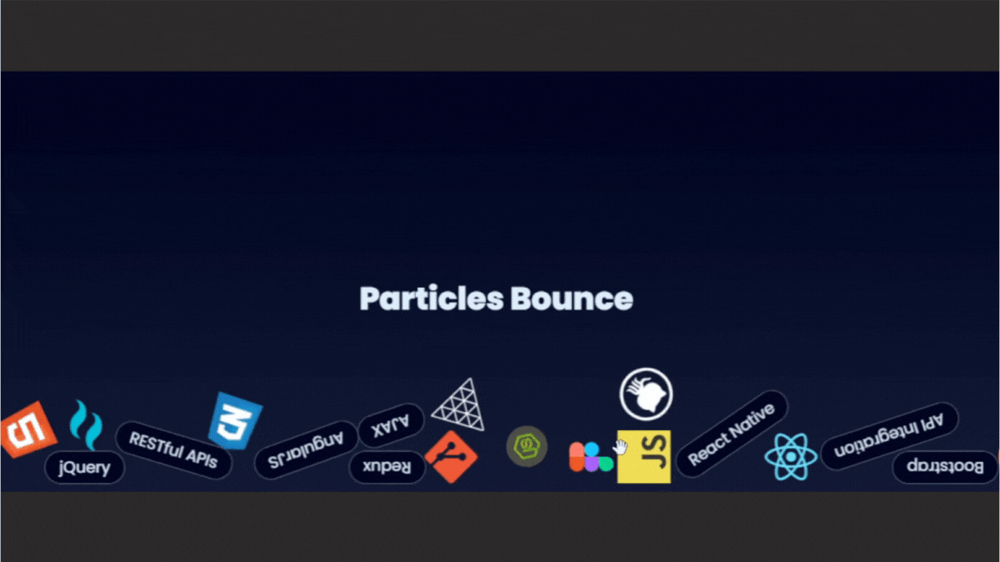

# 🎈 ParticleBounce — React + Matter.js Interactive Physics Component

A interactive **React + Matter.js** component that brings physics-based bouncing effects to any DOM element. It allows DOM elements (e.g., images or text) to bounce, collide, and respond to user interaction like dragging, giving a dynamic and playful experience.

---

## ✨ Features

- ⚛️ Built with React + Matter.js
- 📦 Reusable component – drop in any set of elements
- 🧲 Realistic physics (gravity, bounce, drag)
- 🖱️ Interactive: supports mouse and touch dragging
- 🎨 Fully customizable styles and assets

---

## 🚀 Demo



---

## 📦 Installation

```bash

npm install matter-js
# or
yarn add matter-js

```
---

Then copy the `ParticleBounce.jsx` component into your project.

## 🔧 Usage

### 1. Prepare your data

```bash

const Data = [ /* your data here */ ];

```

### 2. Create Refs for Elements

```bash

const elementRefs = useRef(Data.map(() => React.createRef()));

```

### 3. Use the Component

🧷 `draggable={false}` is **required** for images.

You can **fully control how your particles look** by customizing the rendering logic. Here’s the default template:

```bash

<ParticleBounce elementRefs={elementRefs}>
  {Data.map((item, i) =>
    item.image ? (
      
    ) : (
      <div
        ref={elementRefs.current[i]}
        key={i}
        className="your-class"
      >
        {item.text}
      </div>
    )
  )}
</ParticleBounce>

```

## Customize:

- 💅 `your-class` — Add your own Tailwind or CSS styles

- ℹ️ All elements must be **absolutely positioned**.

- ✅ Required CSS Styles

```bash

.your-class {
  position: absolute;             /* ℹ️ Required for positioning */
  pointer-events: auto;           /* ✅ Enables drag interactions */
  will-change: transform;         /* ✅ Optimizes GPU rendering */
}

```

Tailwind users can use:

```bash

className="absolute pointer-events-auto will-change-transform"

```


---

### 🧪 Example Setup

```bash

import React, { useRef } from 'react';
import ParticleBounce from './ParticleBounce';

const Data = [
  { text: null, image: '/github.svg' },
  { text: 'React', image: null },
  // ...
];

const elementRefs = useRef(Data.map(() => React.createRef()));

export default function App() {
  return (
    <div className="relative w-full h-screen">
      <ParticleBounce elementRefs={elementRefs}>
        {Data.map((item, i) =>
          item.image ? (
            
          ) : (
            <div
              ref={elementRefs.current[i]}
              className="absolute text-white px-4 py-2 pointer-events-auto cursor-grab will-change-transform"
              key={i}
            >
              {item.text}
            </div>
          )
        )}
      </ParticleBounce>
    </div>
  );
}


```