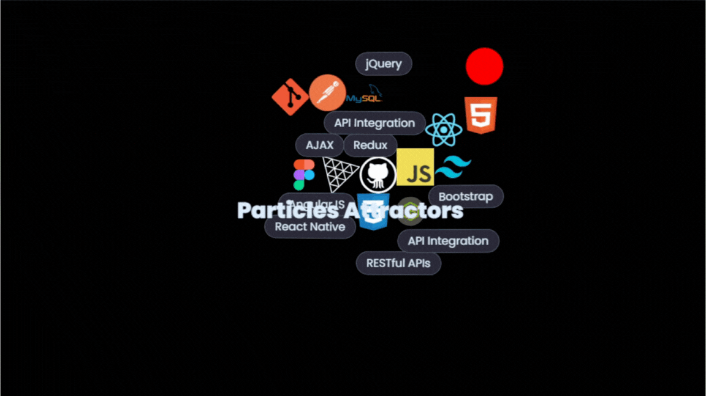

# 🧲 Particle Attractors with Matter.js in React

Interactive particle system built with **React** and **Matter.js**, where DOM elements (images, text etc.) act as floating bodies attracted to a central force.

---

## 🚀 Features

- 🔴 Dynamic **attractor** object following mouse/touch
- 🧱 Particles are DOM elements, not canvas drawings
- 📦 Physics simulation powered by [Matter.js](https://brm.io/matter-js/)
- 🎯 **Mouse/touch drag support** to move the attractor
- 🧩 Fully **responsive** to screen resize

---

## 🚀 Demo



---

## 📦 Installation

```bash
npm install matter-js matter-wrap matter-attractors
# or
yarn add matter-js matter-wrap matter-attractors
---

Then copy the `ParticleAttractor.jsx` component into your project.

## 🔧 Usage

### 1. Prepare your data

```bash

const Data = [ /* your data here */ ];

```

### 2. Create Refs for Elements

```bash

const elementRefs = useRef(Data.map(() => React.createRef()));

```

### 3. Use the Component

You can **fully control how your particles look** by customizing the rendering logic. Here’s the default template:

```bash

<ParticleAttractor elementRefs={elementRefs}>
  {Data.map((item, i) =>
    item.image ? (
      
    ) : (
      <div
        ref={elementRefs.current[i]}
        key={i}
        className="your-class"
      >
        {item.text}
      </div>
    )
  )}
</ParticleAttractor>

```

## Customize:

- 💅 `your-class` — Add your own Tailwind or CSS styles

- ℹ️ All elements must be **absolutely positioned**.

- ✅ Required CSS Styles

```bash

.your-class {
  position: absolute;             /* ℹ️ Required for positioning */
  will-change: transform;         /* ✅ Optimizes GPU rendering */
}

```

Tailwind users can use:

```bash

className="absolute will-change-transform"

```


---

### 🧪 Example Setup

```bash

import React, { useRef } from 'react';
import ParticleAttractor from './ParticleAttractor';

const Data = [
  { text: null, image: '/github.svg' },
  { text: 'React', image: null },
  // ...
];

const elementRefs = useRef(Data.map(() => React.createRef()));

export default function App() {
  return (
    <div className="relative w-full h-screen">
      <ParticleAttractor elementRefs={elementRefs}>
        {Data.map((item, i) =>
          item.image ? (
            
          ) : (
            <div
              ref={elementRefs.current[i]}
              className="absolute text-white px-4 py-2 will-change-transform"
              key={i}
            >
              {item.text}
            </div>
          )
        )}
      </ParticleAttractor>
    </div>
  );
}


```